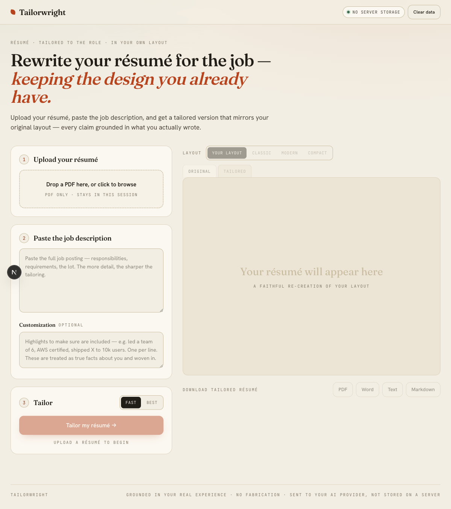
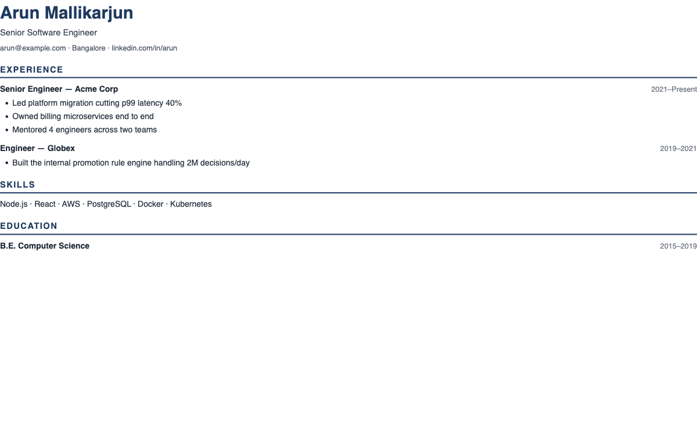

# Tailorwright

Tailor a résumé to a job description — in your résumé's **own layout**, or in a
clean ATS-friendly template — with the claim that every line stays grounded in
what you actually wrote.



It ships in **four forms** so anyone can use it:

| Form | For whom | How it tailors | Needs |
|---|---|---|---|
| **Web app** | Anyone with a browser | Calls Claude or Gemini server-side | An API key, a running server |
| **Claude Code Skill** (`/job-hunt`) | Anyone using Claude Code | Claude does it in-session | Just Claude Code — no API key |
| **Subagent** (`resume-tailor`) | Claude Code workflows | Wraps the skill | Just Claude Code |
| **Headless CLI** (`pnpm tailor`) | CI, cron, scripts | `@anthropic-ai/sdk` | `ANTHROPIC_API_KEY` |

All four share one core: the prompts in [`lib/ai/prompts.ts`](lib/ai/prompts.ts) and
the deterministic template renderers in [`lib/templates/`](lib/templates/).

## Quickstart — the Claude Code skill (no API key, no server)

The fastest way to use Tailorwright. Install the `/job-hunt` skill globally,
then tailor any résumé entirely on your own machine:

```bash
# Install the job-hunt skill for Claude Code
git clone https://github.com/MrArun005/resume-tailor.git /tmp/resume-tailor \
  && cp -r /tmp/resume-tailor/.claude/skills/job-hunt ~/.claude/skills/ \
  && echo "Done — restart Claude Code, then type /job-hunt"
```

Restart Claude Code and type **`/job-hunt`** — point it at your résumé file and a
job description (plus an optional template or must-include highlights). Claude does the
tailoring **in-session**: no API key, no server, no third-party upload — your résumé
stays local. It renders a clean, ATS-friendly HTML/PDF you can send.

## Features

- **Two layout modes:** a faithful **mirror** of your original PDF's design, or one
  of three ATS-friendly templates — **Classic** (serif), **Modern** (sans + accent),
  **Compact** (dense). Switch instantly; export matches what you see.
- **Grounded tailoring:** the model never fabricates employers, titles, dates,
  degrees, or technologies — it reframes what's truthfully in your résumé.
- **Customization:** add must-include highlights (plain text); they're treated as
  true, candidate-supplied facts and woven into the right section.
- **Version history + diff:** every tailor run is saved (last 5); compare any two and
  see exactly what changed (added/removed lines, per section).
- **Consistent pagination:** 1.25cm margins on every page; long entries flow across
  page breaks instead of leaving gaps.
- **Exports:** PDF, Word (.docx), plain text, Markdown.

A résumé rendered into the **Modern** template:



## Web app

```bash
pnpm install
pnpm exec playwright install chromium   # for server-side PDF export
cp .env.example .env.local              # add ANTHROPIC_API_KEY and/or GEMINI_API_KEY
pnpm dev                                # http://localhost:3000
```

**Pipeline:**
1. `POST /api/analyze` — PDF → `{ content, templateHtml }` (layout reconstruction; the HTML is normalized to guarantee print margins).
2. `POST /api/tailor` — `{ content, templateHtml, jobDescription, customization }` → `{ tailoredContent, tailoredHtml, changes[] }`.
3. `POST /api/export` — `{ format, html | content }` → downloadable file. The PDF renderer blocks all network/`file://` loads (SSRF-safe).

## Claude Code Skill / Subagent

Installed under [`.claude/`](.claude/). In Claude Code:

- `/job-hunt` — point it at a résumé file + a job description (+ optional
  template/highlights). **Claude does the tailoring in-session — no API key, no
  server, no third-party service; your résumé stays local.** It renders to HTML via
  [`.claude/skills/job-hunt/scripts/render.mjs`](.claude/skills/job-hunt/scripts/render.mjs)
  (dependency-free) and you Print → Save as PDF.
- The `resume-tailor` subagent is a thin specialist that invokes the skill from
  larger workflows.

## CLI

```bash
export ANTHROPIC_API_KEY=...
pnpm tailor --resume me.pdf --jd job.txt --template modern \
  --custom "led a team of 6; AWS certified" --out tailored.html
```

Runs headless via `@anthropic-ai/sdk` (Claude Opus 4.8). Reuses the same prompts and
templates as the web app.

## Privacy & security

- **Your résumé is sent to the AI provider you configure** (web app / CLI). It is
  **not stored on any server** — only in your browser's `localStorage`, which the
  **Clear data** button wipes. The **Skill/Subagent** keep everything in the Claude
  Code session.
- ⚠️ The **free Gemini / AI Studio tier may use your data to train Google's models.**
  For private résumé data, use a paid Gemini API / Vertex tier or the Anthropic API
  (which doesn't train on API data). See [`.env.example`](.env.example).
- `DEBUG_AI=1` enables verbose model logging to disk — leave it unset in shared/deployed environments.

## Testing

```bash
pnpm test        # vitest — template renderers, HTML normalizer, résumé diff
```

## Troubleshooting

- **"No AI engine configured" / analyze fails (web app, CLI):** a key is missing or
  malformed. Anthropic keys start with `sk-ant-`; Google AI Studio keys start with
  `AIzaSy` (a value beginning `AQ.` is an OAuth token, not an API key). Fix
  `.env.local` and restart the dev server — `.env.local` is only read at startup.
- **PDF export errors locally:** run `pnpm exec playwright install chromium`.
- **The Skill doesn't appear in Claude Code:** ensure the folder lives at
  `.claude/skills/job-hunt/` in the project, or copy it to `~/.claude/skills/`
  for global use, then restart Claude Code.

## Stack

Next.js 16 · React 19 · TypeScript · Tailwind 4 · `@anthropic-ai/sdk` · `@google/genai`
· Playwright · html-to-docx · Vitest.

See [`SPEC.md`](./SPEC.md) and the design/plan docs under
[`docs/superpowers/`](docs/superpowers/) for the full design.
